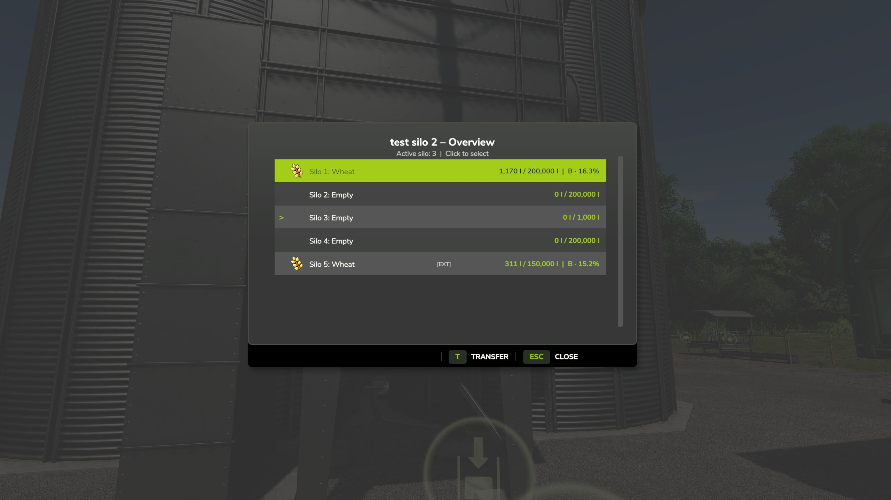
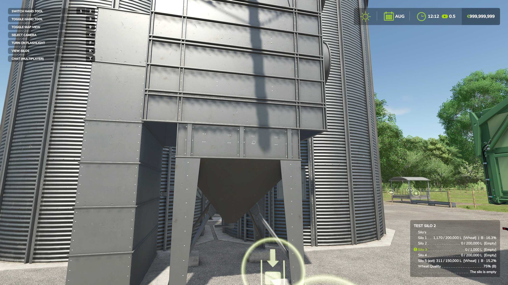
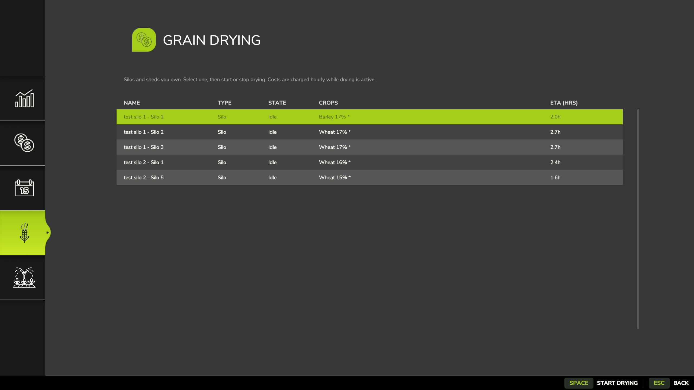

# RealSilo – Realistic Silo Compartments

RealSilo divides your farm silos into separate compartments, each holding
one type of product, instead of mixing everything into one large tank. You
decide how many compartments a silo gets and how much each one can hold.

## Features

- Split any farm silo into 1–32 independent compartments, each with its own
  crop and capacity.
- Only the active compartment receives or unloads grain — no more mixing.
- Transfer grain between compartments at an adjustable speed.
- Silo extensions are supported and show up as extra compartments in the
  same menu.
- Grain that was already in a silo before RealSilo was installed is kept
  and distributed across compartments the first time you configure it.
- In multiplayer, only the farm admin can change silo settings; every
  player can use the silo normally and view the compartment overview.
- Full compatibility with [FS25_MoistureSystem](https://github.com/Ozz-Modding/FS25_MoistureSystem):
  moisture and quality are tracked independently per compartment, including
  drying, and this now also works correctly for every player on a dedicated
  server, not just the host.

## How it works

1. Walk up to an existing silo or place a new one and press the RealSilo
   key (default **K**, changeable under Options > Controls) to open the
   configuration dialog. In multiplayer, only the admin can do this.
2. Choose how many compartments the silo should have and how much each one
   can hold.
3. Select the active compartment from the overview — only that compartment
   receives or unloads grain until you pick a different one.
4. Use the Transfer function to move grain between compartments at your own
   pace.

## Installation

1. Download `FS25_RealSilo.zip` from the [Releases](../../releases) page
   (or from the [Giants ModHub](https://www.farming-simulator.com/mods)).
2. Drop the zip into your FS25 `mods` folder — do **not** unzip it.
3. Enable it in the in-game mod selection when starting or hosting a
   savegame.

## For modders

Building a silo mod of your own and want it to integrate with RealSilo out
of the box (automatic compartment layout, no manual player configuration
needed)? See [`README_modders.md`](README_modders.md) for the full
`<realSilo>` / `<realSiloExtension>` XML reference.

## Compatibility

- **[FS25_MoistureSystem](https://github.com/Ozz-Modding/FS25_MoistureSystem):**
  fully supported. Each compartment dries independently and appears as its
  own entry in the Grain Drying menu (Shift+M), for every player — host or
  client, singleplayer or dedicated server.

## Reporting problems

Found a bug or have a suggestion? Please open an issue on GitHub:
https://github.com/JoVink82/FS25_realSilo/issues

## Author

Jo_Vink
